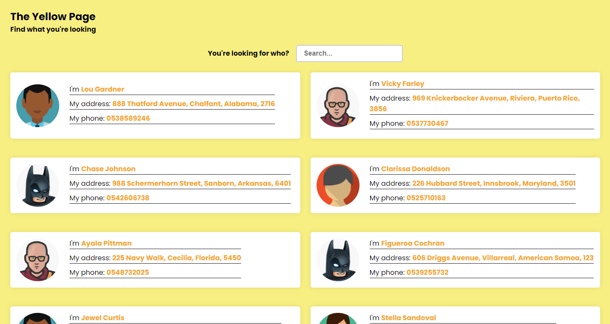

# Blings Exercise - Yellow Page Search

This is a solution to the Blings 2° phase interview: Creating a Yellow Page webapp with backend

## Table of contents

- [Overview](#overview)
  - [The challenge](#the-challenge)
  - [Screenshot](#screenshot)
  - [Build with](#build-with)
  - [Links](#links)
  - [How to run](#how-to-run)
- [Author](#author)

## Overview

### The challenge

Users should be able to:

- Enter a information about a contact and get the results back of the search as contacts cards.
- The information is unstructured and can be anything, like a name, phone number, age, or a combination of all of them. The webapp should be able to search for any of the information.

### Screenshot



### Built with

- CSS custom properties
- Flexbox
- CSS Grid
- Mobile-first workflow
- [AWS Amplify](https://amplify.aws/) - AWS SDK for JavaScript
- [React](https://reactjs.org/) - JS library

### Links

- Live Site URL: [Add live site URL here](https://master.d268askmx46p4q.amplifyapp.com/)

### How to run

To run the app, you need to install the AWS Amplify CLI.

```bash
npm install -g aws-amplify-cli
```

Then you need to create a new project.

```bash
amplify init --app https://github.com/Senatauro/yellow-pages
```

This will ask your for your AWS Amplify credentials. If you already have a profile choose it and continue.
If you don't have a profile, you must create one on the AWS Console.

After creating the profile and using it to login the Amplify CLI will download the project and create the cloud resources for the project to run. This process will take a while...

After the cloud resources are created, you can run the project.

```bash
npm start
```

For the first time running the project, it will populate the database with some data used in the exercise.
Wait some 15 seconds and refresh the page. You should see the search results.

The images from the profiles will not be loaded automatically. For it to run you must upload the files to the cloud on the S3 bucket created for this project.

[Go for S3 page](https://s3.console.aws.amazon.com/s3/buckets?region=us-east-1) and choose the bucket name: `yellow-pages-blings...`(... is number + environment)


This is the bucket that was created for me. Open it and, inside of it, create a folder called `public` and upload the images to it.

After this the contact cards will have the images.


## Author

- GitHub - [@Senatauro](https://github.com/Senatauro)


## Atributes

- <a href="https://www.flaticon.com/free-icons/menu" title="menu icons">Menu icons created by Freepik - Flaticon</a>